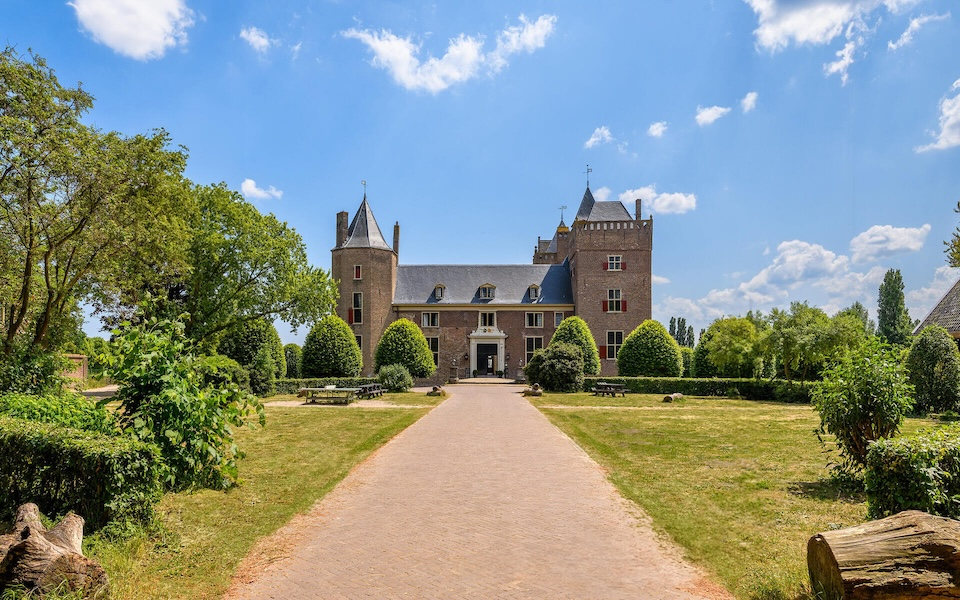

Great that you will come to our wedding!
On this website you will find all information for our wedding day.
If you still have questions after reading through this information, feel free to send them to: `bruiloftmalice@gmail.com`.

Wil je deze pagina liever in het Nederlands lezen, bezoek dan de [Nederlandse website](index.md).

## Date en location 

The wedding is held on July 4th 2025 in the youth hostel [Stayokay Slot Assumburg](https://www.stayokay.com/en/hostel/heemskerk).
The address is Tolweg 9, 1967 NG Heemskerk, the Netherlands.
Details on how to reach the venue can be found on the website of the location.

## Schedule
This is the program of the wedding day. Please be aware that due to location capacity we were not able to invite all guests for all program items.

| Tijd            | Onderdeel         |
|:----------------|:------------------|
| 14:00-14:30     | Arrival           |
| 14:30-15:30     | Ceremony          |
| 16:00-18:00     | Reception         |
| 18:30-20:30     | Dinner            |
| 20:30-01:00     | PARTY!            |

## Sleeping arrangements
For the guest who are joining the party it is possible to spend the night in the hostel! 
We have reserved 50 beds (incl. breakfast) in the Stayokay. 
If you are interested to stay the night please reach out to us on: `bruiloftmalice@gmail.com`.
We will come back to you if there are still beds available. 

*NB: since it is a hostel, rooms are shared (2, 4 or 6 ppl per room).*
*If you prefer a private room and would like to stay the night, you can contact the Stayokay directly and reserve a private room at your own cost.* 

## Dresscode
There is no strict dresscode for our wedding, so feel free to wear what feels good for you!

## Gifts
We do not have specific wishes for gifts. We are always happy with a contribution towards our honeymoon. 
It will be possible to deposit envelopes on the day or if you prefer to make a digital donation you can transfer money to NL67ABNA0620188642.
